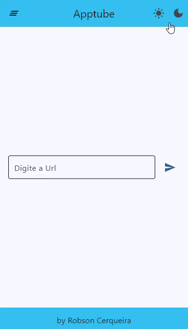

# MVP do aplicativo APPTUBE desenvolvido com FLET

<h2>O que é Flet 

<h4>Flet é um framework que permite criar aplicativos web, desktop e móveis em Python sem experiência prévia em desenvolvimento frontend.
<br><br>
Você pode criar uma UI para seu programa com controles Flet que são baseados no Flutter do Google. O Flet vai além de simplesmente envolver widgets Flutter. Ele adiciona seu próprio toque combinando widgets menores, simplificando complexidades, implementando as melhores práticas de UI e aplicando padrões sensatos. Isso garante que seus aplicativos tenham uma aparência elegante e polida sem exigir esforços adicionais de design de sua parte.
<br>

Acessar o Site:
```
https://flet.dev
```

<h4>Para conseguir rodar o aplicativo voçê precisa ter o python instalado em sua máquina.
<br>
Com o python instalado você consegue criar uma maquina virtual para conseguir instalar os frameworks que usamos.
<br><br>


Utilizando o codigo
```
Windows: python -m venv venv

Linux: pytoon3 -m venv venv
```
Para ativar o ambiente virtual
```
Windows: source venv/Scripts/activate

Linux: source venv/bin/activate
```
"Lembrando que você tem que estar dentro do mesmo diretório do seu arquivo e criar seu ambiente virtual, ressaltando que no windows esse último comando não funciona pelo PowerShell."

Com o seu ambiente ativado você perceberá o nome dele acima do caminha do seu computador como na imagem abaixo:


Execute o seguinte comando:
```
pip install -r requirements.txt
```

Nesse arquivo estão todas as bibliotecas que utilizamos, apesar de utilizarmos apenas duas bibliotecas. Isso aconteceu pois ao instalar o flet ele ja instalar outras bibliotecas que poderemosutilizar futuramente com os diveresos tipos de aplicações que fizermos.

As bibliotecas que utilizamos foram:

```
Flet e PyTubeFix
```

<br>
Para rodar o app:

<br>

```
flet run [dentro do diretório]
```
<br>
<h3>O Flet utilizamos para desenvolver o aplicativo utilizando python como liguagem de programação e o PyTubeFix para realizar consulta dos vídeos pela url, e possamos assim realizar o download em MP4 ou MP3, como preferir.

<h2>Enjoey

<br>
<br>
Aplicativo Funcionando:
<br>
<br>
<br>


